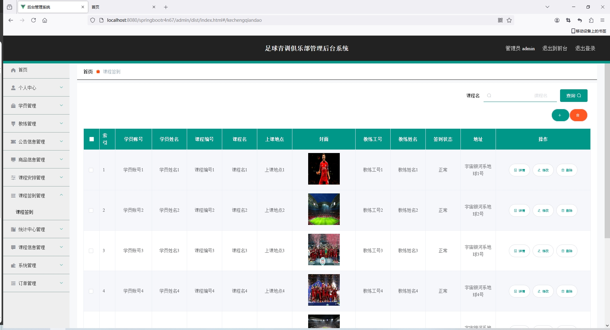

<h1 align="center">基于SpringBoot框架的足球青训俱乐部管理系统【带文档】</h1>

 获取sql文件 QQ: 3645296857 QQ群: 978300347 

<h4> 需要视频演示可联系上述QQ，私发视频链接 </h4>

 获取更多高质量源码，请访问：[mzoo源码网](https://mzoocodes.com/)

## 简介

> 本代码来源于网络,仅供学习参考使用!
>
> <b style="color: dodgerblue"> 提供1.远程部署/2.修改代码/3.定制程序/4.文档指导/5.框架代码讲解、技术解答、代码讲解等服务 </b>
>
> 前台地址：http://localhost:8080/springbootr4n67/front/index.html
> 
> 后台地址：http://localhost:8080/springbootr4n67/admin/dist/index.html
>
> 管理员: admin 密码: 123456
> 
> 教练：教练1 密码：123456
> 
> 学员：学员1 密码：123456
>

## 项目介绍

基于SpringBoot框架的足球青训俱乐部管理系统【带文档】：前端 JSP，后端 SpringMvc、Mybatis，系统角色分为：管理员、教练和学员，管理员在管理后台用户信息、公告信息、商品管理等；教练可以对商品信息管理、课程安排管理、课程签到管理等；学员可以选择课程、商品购买等。主要功能如下：

### 管理员

- 基本操作: 登录、修改密码、修改个人信息、查看个人信息、上传图片、统计
- 学员管理: 获取学员信息列表、查看学员信息详情、筛选学员信息、新增学员信息、删除学员信息、修改学员信息
- 教练管理: 获取教练信息列表、查看教练信息详情、筛选教练信息、新增教练信息、删除教练信息、修改教练信息
- 公告信息管理: 获取公告信息列表、查看公告信息详情、筛选公告信息、新增公告信息、删除公告信息、修改公告信息、预览视频信息
- 商品信息管理: 获取商品信息列表、查看商品信息详情、筛选商品信息、新增商品信息、删除商品信息、修改商品信息
- 课程安排管理: 获取课程安排列表、查看课程安排详情、筛选课程安排、新增课程安排、删除课程安排、修改课程安排
- 课程签到管理: 获取课程签到列表、查看课程签到详情、筛选课程签到、新增课程签到、删除课程签到、修改课程签到
- 统计信息管理: 获取统计信息列表、查看统计信息详情、筛选统计信息、新增统计信息、删除统计信息、修改统计信息、查看统计信息
- 课程信息管理: 获取课程信息列表、查看课程信息详情、筛选课程信息、新增课程信息、删除课程信息、修改课程信息
- 轮播图管理: 获取轮播图列表、查看轮播图详情、筛选轮播图、新增轮播图、删除轮播图、修改轮播图
- 订单管理: 获取订单列表、查看订单详情、筛选订单、删除订单、修改订单、发货、支付

### 教练

- 基本操作: 登录、注册、修改密码、修改个人信息、查看个人信息、上传图片
- 公告管理: 获取公告列表、查看公告详情、筛选公告信息、预览公告视频
- 商品信息管理: 获取商品信息列表、查看商品信息详情、筛选商品信息
- 课程安排管理: 获取课程安排列表、查看课程安排详情、筛选课程安排、考勤签到
- 课程签到管理: 获取课程签到列表、查看课程签到详情、筛选课程签到、考勤签到、修改考勤信息、新增考勤

### 学员

- 基本操作: 登录、注册、修改密码、修改个人信息、查看个人信息、上传图片、充值
- 公告模块: 获取公告信息列表、查看公告详情、筛选公告信息
- 商品模块: 获取商品信息列表、查看商品详情、筛选商品信息、添加购物车、支付、删除购物车内容
- 课程安排模块: 获取课程安排列表、查看课程安排详情、筛选课程安排
- 订单模块: 获取订单列表、查看订单详情、筛选订单、确认订单
- 个人中心: 获取课程安排列表、查看课程安排详情、筛选课程安排、获取地址信息列表、添加地址信息、修改地址信息、删除地址信息

## 环境

- <b>IntelliJ IDEA 2020.3</b>

- <b>Mysql 5.7.26</b>

- <b>Maven 3.6.3</b>

- <b>JDK 1.8</b>

## 运行截图

